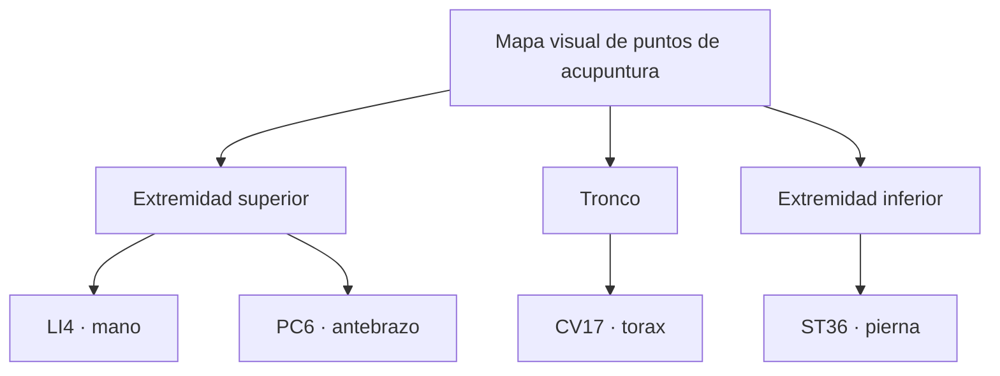

# DIAGRAMAS-

## Explicacion visual de puntos de acupuntura

Este proyecto presenta una introduccion visual y educativa a algunos puntos de referencia de acupuntura mediante tres formatos de diagrama:

La direccion visual combina una paleta aventurera de azul marino, dorado y rojo con un acabado de manga sobrenatural: alto contraste, contornos de tinta y acentos dramaticos. Es una interpretacion original, sin usar personajes, logotipos ni imagenes de las series de referencia. Todos los recursos son vectoriales o texto; no se generan mapas de bits.

- [Diagrama SVG](diagramas/puntos-acupuntura.svg): mapa visual con silueta y referencias corporales.
- [Diagrama Excalidraw](diagramas/puntos-acupuntura.excalidraw): esquema editable para abrir en Excalidraw.
- [Diagrama Mermaid](diagramas/puntos-acupuntura.mmd): relaciones entre regiones corporales y puntos de referencia.

Los puntos incluidos son LI4 (mano), PC6 (antebrazo), CV17 (torax) y ST36 (pierna). El material es informativo y no sustituye una evaluacion, diagnostico ni tratamiento profesional. La localizacion exacta y cualquier uso clinico deben realizarse con personal sanitario cualificado.

### Vista rapida del diagrama Mermaid

